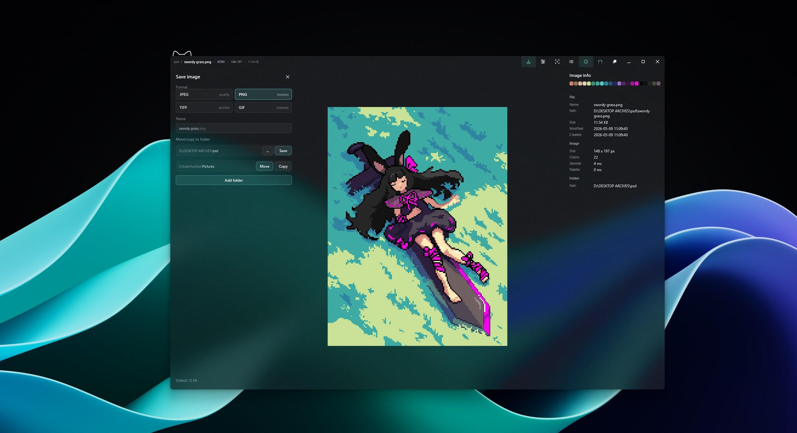
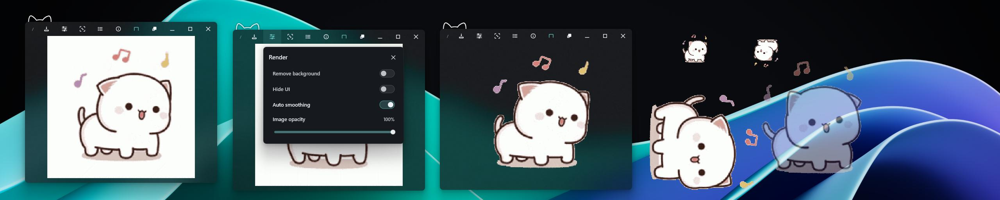

# Nekopeek

Super tiny, super fast and powerful image viewer with clean minimal interface for Windows 10/11.

## Download
[GitHub Releases](https://github.com/unikotoast/nekopeek/releases) for alpha builds Windows may show a SmartScreen warning.
Status: alpha, in active development

## Features

- Less than 1 MB on disk, minimal RAM/CPU/GPU usage and instant startup
- Background removal for static and animated images
- Precise controls for animated images
- Two-page mode for manga and comics
- Opens ZIP and CBZ archives without extracting
- Crop, rotate, and save optimization tools
- Detailed image information with color palette

> Autoremove image background, hide UI, change transparency, rotate/mirror 

## Planned

>Gallery and folder navigation view 
>More editing tools 
>Image effects 
>UI and hotkey customization 
>More stability and options 
>More supported formats 
>Experimental features 
>Translations

## Feedback

Nekopeek is in alpha so reports and suggestions are welcome, feel free to create an issue or contact me personally.

- [Nekopeek on X](https://x.com/nekopeekapp)
- [Created by unikoToast](https://x.com/unikotoast)

> Copyright © 2026 unikoToast. All rights reserved.

